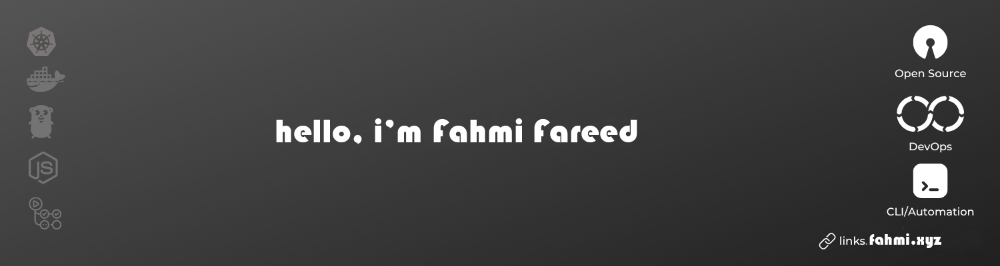

 

## Biography

Welcome to my GitHub page, hopefully you will find something useful here.  

**From Code to Deployment, DevOps Engineer's Journey | Python Programming |AWS | Terraform | Docker | CKA | GCP certified**

I am a [Microsoft DevOps MVP](https://mvp.microsoft.com/en-us/PublicProfile/5004771?fullName=Marcel%20Lupo), Cloud Solutions & DevOps Architect and technical speaker focused on Microsoft technologies in the Azure cloud platform and specialise particularly in Automation, DevOps and Developer Technologies, with a strong focus on IaC, Azure DevOps and GitHub.
I am passionate about technology and how it can be used in automation to bring value and solve complex business problems.

Regular speaker at conferences and meetups, and enjoy sharing knowledge and technical content with the wider tech community. Currently works at Avanade UK&I as a Group Manager in DevOps Engineering.

## Certifications and Awards:
[Link to my Credly page](https://www.credly.com/users/marcel-lupo/badges)

<strong>11 Jan 2024</strong> | <strong>Updated: 11 Jan 2024</strong>

  Logs are crucial for understanding the inner workings of an application, whether it's to ensure it performs as expected or to help in debugging when encountering errors.
However, consider a scenario where one of your teammates is working and developi... 
    
<!-- HASHNODE_BLOG:END -->

### STATS
<!--START_SECTION:waka-->
<!--END_SECTION:waka-->
